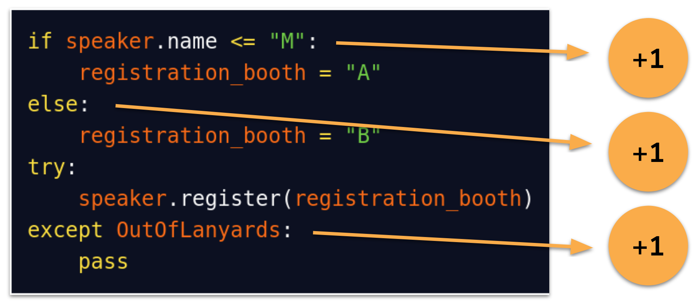

#######
Metrics
#######

:Created: 2022-04-19
:Last Updated: 2022-04-28

Code quality metrics are designed to model or mirror human intuition on what "good" code looks like.
This means they inherit human biases, without necessarily being tempered by human "common sense".
Nevertheless, poor code quality metrics can be a strong indicator of overly-complex or difficult-to-maintain code
and code analytics can help identify areas in need of improvement.

The ``sourcery-analytics`` repository provides several code quality metrics, with room to grow.

Function Length
===============

See :py:mod:`.method_length`

Most style guides will tell you to keep your functions short.
There are several good reasons to encourage short functions:

* by focusing on a single idea, they are easier to understand
* because they are easy to reason about, they are easier to compose together into more powerful functions
* they are easier to test

Analysing function length is therefore an easy an effective way to assess code quality.
``sourcery-analytics`` calculates function length by counting the number of statements in the function's body.

Strategies to reduce long functions include extracting smaller functions, simplifying loops and conditionals using
comprehensions, or delegating custom process to library tools.

Cyclomatic Complexity
=====================

See :py:mod:`.cyclomatic_complexity`

Although longer functions tend to be more complex, there are clear differences in the complexity of
functions with the same length.
For instance, consider the following snippet:

.. code-block:: python

   if talk.length < 45:
       talk.length = 40
   elif talk.category == "Continuous Integration Systems"
       if talk.room_number in {4, 5}:
           if talk.length > 50:
               talk.length = 45
   ...

This code only has seven statements but quickly gets difficult to understand.
One way of rationalizing this complexity is by considering the number of *branches* in the code.
Branching code is more difficult to reason about, and this raises the potential for accidentally including
bugs in your code.

Cyclomatic Complexity [#]_ is a metric designed to capture the number of branches in code.
In Python, it can be easily calculated based on if/elif/else statements, try/except blocks, and so on - for details
see :py:mod:`.cyclomatic_complexity`.

Cyclomatic complexity can be reduced by favouring lookups instead of if/else statements and keeping functions
concise and focused on a single workflow.

Cognitive Complexity
====================

See :py:mod:`.cognitive_complexity`

Cyclomatic complexity captures code quality issues not handled by function length alone. However, there is
clearly further to go. The following two snippets both share the same cyclomatic complexity, but the second
is more difficult to understand.

.. code-block:: python

   if not talk.name.startswith("Keynote:"):
       print("Standard talk")
   elif talk.length < 5:
       print("Lighting talk")
   elif talk.sponsor:
       print("Sponsored talk")
   elif has_high_interest(talk.subject):
       print("Featured talk")

.. code-block:: python

   if talk.title.contains(keyword):
       if talk.length > 40:
           if large_number(talk.attendees):
               for attendee in talk.attendees:
                   print(attendee.name)

The additional difficulty here can be explained by focusing on the code's nesting.
When code is nested, it becomes increasingly difficult for us to keep track of the context of the
statement being executed. This insight motivated the creation of a metric called cognitive complexity,
developed by SonarSource [#]_.

It is calculated similarly to cyclomatic complexity: if statements, for loops, and other control flow statements increment
the cognitive complexity. However, these control flow elements also incur a penalty for all other statements in their body.

.. figure:: _static/img/calculation-cognitive-complexity.png
   :width: 400
   :alt: a visual depiction of the methodology for calculating cognitive complexity

To reduce cognitive complexity, favour "flatter" code over nested code (often achieved easily through function extraction)
and, as before, aim for concise functions with single responsibilities.

Working Memory
==============

See :py:mod:`.working_memory`

One area of complexity not captured by any of the metrics mentioned above can be demonstrated using the following
code:

.. code-block:: python

   all([
     	talk.is_keynote(),
     	talk.is_day_one(),
     	len(talk.speakers) > 3,
     	any(map(is_first_time_speaker, talk.speakers)),
   ])

This code only comprises a single statement, with no control flow, yet it is nevertheless relatively complex.

We can encapsulate this complexity by considering how much information we need to keep in mind as we read
code. "Information" in this context is relatively subjective, but, roughly, each variable, function call,
and attribute counts as an additional "piece of information". For a series of statements, we calculate the one
with the maximum count of these pieces, in a metric called the working memory, with increments based on conditions.

.. figure:: _static/img/calculation-working-memory.png
   :width: 400
   :alt: a visual depiction of the methodology for calculating working memory

To reduce working memory, strategies include introducing layers of abstraction, such as combining
variables into classes, breaking functions apart into smaller ones, and, as usual, designing concise functions
with clear roles.

References
==========

.. [#] T. J. McCabe, "A Complexity Measure," in IEEE Transactions on Software Engineering, vol. SE-2, no. 4, pp. 308-320, Dec. 1976, doi: 10.1109/TSE.1976.233837.
.. [#] Campbell, G. Ann, and Product Owner-SonarSource SA. "Cognitive complexity." Proceedings of the 2018 International Conference on Technical Debt-TechDebt’. Vol. 18. 2018.